# Chess V1

## Class Diagram



## LLD Requirements Fulfilled

### 1. **Scalability & Extensibility**
- ✅ **Multiple Game Support**: `BoardGames` interface allows adding different board games
- ✅ **Multiple Player Types**: Easy to add new player types (Remote, Advanced AI, etc.) via `PlayerFactory`
- ✅ **Extensible Piece System**: Strategy pattern allows adding new piece types with custom movement rules
- ✅ **Configurable Board Size**: Parameterized board size through constants
- ✅ **Modular Movement Logic**: Each piece has its own movement strategy implementation
- ✅ **Game State Management**: Comprehensive game status tracking and move logging

### 2. **Core Chess Mechanics**
- ✅ **Standard Chess Setup**: Proper initial board configuration with all pieces
- ✅ **Piece-Specific Movement**: Individual movement algorithms for each piece type
- ✅ **Turn-Based Gameplay**: Alternating white and black player turns
- ✅ **Basic Move Validation**: Coordinate validation and piece ownership checks
- ✅ **Piece Capture Logic**: Proper handling of piece captures and elimination
- ✅ **Game History Tracking**: Complete move log for analysis and replay

### 3. **Advanced Chess Rules** (Foundation Implemented)
- ✅ **Basic Movement Rules**: All standard piece movements implemented
- ✅ **Capture Mechanics**: Piece elimination on capture
- ✅ **Win Condition**: King capture detection for game termination
- ⚠️ **Special Moves**: Castling foundation in King strategy (needs completion)
- ⚠️ **Advanced Rules**: Check/Checkmate, En Passant, Pawn Promotion (extensible architecture)

### 4. **System Architecture & Quality**
- ✅ **Clean Separation of Concerns**: Game logic separated from UI and piece management
- ✅ **Error Handling**: Input validation and move verification
- ✅ **Resource Management**: Proper object lifecycle and memory management
- ✅ **Type Safety**: Comprehensive enum usage for game constants
- ✅ **Singleton Management**: Single board instance with proper lifecycle

## Design Patterns Used

### 1. **Strategy Pattern**
- **Implementation**: `MovementStrategy` interface with piece-specific strategies
- **Purpose**: Different movement behaviors for each chess piece
- **Benefit**: Easy to add new pieces or modify movement rules without changing existing code

```java
public interface MovementStrategy {
    boolean canMove(Board board, Cell startCell, Cell endCell);
}

// Piece-specific implementations
class PawnMovementStrategy implements MovementStrategy { /* Pawn logic */ }
class KingMovementStrategy implements MovementStrategy { /* King logic */ }
class QueenMovementStrategy implements MovementStrategy { /* Queen logic */ }
```

### 2. **Factory Pattern**
- **Implementation**: `PieceFactory` and `PlayerFactory`
- **Purpose**: Creates objects without exposing instantiation logic
- **Benefit**: Easy to add new piece types and player types

```java
Piece king = PieceFactory.createPiece(PieceType.KING, true);
Player human = PlayerFactory.getPlayerOfType(PlayerType.HUMAN, "Alice", true);
Player ai = PlayerFactory.getPlayerOfType(PlayerType.AI, "Bob", false);
```

### 3. **Singleton Pattern**
- **Implementation**: `Board.getBoardInstance()`
- **Purpose**: Ensures only one game board exists per game session
- **Benefit**: Prevents multiple board instances and ensures consistent game state

### 4. **Template Method Pattern**
- **Implementation**: `BoardGames` interface
- **Purpose**: Defines common structure for all board games
- **Benefit**: Standardized game flow for future game additions

### 5. **Command Pattern** (Implicit)
- **Implementation**: `Move` class encapsulating move operations
- **Purpose**: Encapsulates move requests as objects
- **Benefit**: Enables move logging, undo functionality, and move analysis

## OOP Principles Followed

### 1. **Encapsulation**
- **Private Fields**: Board state, piece positions, game status, move history
- **Public Methods**: Controlled access through well-defined interfaces
- **Data Hiding**: Internal movement calculations and board management hidden

### 2. **Inheritance**
- **Base Classes**: Abstract `Piece` and `Player` classes
- **Derived Classes**: Specific pieces (King, Queen, Pawn, etc.) and player types (Human, AI)
- **Code Reuse**: Common attributes and methods in base classes

### 3. **Polymorphism**
- **Runtime Polymorphism**: `MovementStrategy.canMove()` behaves differently for each piece
- **Interface Polymorphism**: `BoardGames` interface allows uniform game treatment
- **Method Overriding**: Piece-specific movement implementations

### 4. **Abstraction**
- **Abstract Classes**: `Piece` and `Player` define contracts without implementation
- **Interfaces**: `MovementStrategy` and `BoardGames` abstract behavior
- **Enums**: Abstract game constants (GameStatus, PieceColor, PieceType, PlayerType)

## Data Structures & Algorithms

### Data Structures Used

1. **2D Array** (`Cell[][]`)
   - **Purpose**: Represents the 8×8 chess board
   - **Time Complexity**: O(1) for access, O(64) for full board operations
   - **Why Used**: Natural representation of grid-based chess board

2. **ArrayList** (`ArrayList<Move>`)
   - **Purpose**: Stores complete game move history
   - **Time Complexity**: O(1) for append, O(n) for search
   - **Why Used**: Efficient move logging and game replay functionality

3. **Custom Objects**
   - **Cell**: Encapsulates board position with piece information
   - **Move**: Represents chess moves with source and destination
   - **Piece**: Represents chess pieces with color and movement strategy

4. **Enums**
   - **PieceType**: Type-safe piece classification (KING, QUEEN, ROOK, etc.)
   - **PieceColor**: Color representation (BLACK, WHITE)
   - **GameStatus**: Game state management (ACTIVE, WHITE_WINS, BLACK_WINS, etc.)

### Algorithms Used

1. **Piece Movement Algorithms**

   **Pawn Movement (Complex Logic)**
   - **Time Complexity**: O(1)
   - **Logic**: Direction-based movement with special rules
   ```java
   // Forward movement: 1 square or 2 squares from starting position
   // Diagonal capture: 1 square diagonally if enemy piece present
   int direction = isWhite ? -1 : 1; // White moves up, black moves down
   boolean validMove = (rowDiff == direction && colDiff == 0 && isEmpty) ||
                      (isInitialPosition && rowDiff == 2*direction && isEmpty) ||
                      (rowDiff == direction && colDiff == 1 && hasEnemy);
   ```

   **Rook Movement (Linear)**
   - **Time Complexity**: O(1)
   - **Logic**: Horizontal or vertical movement only
   ```java
   boolean validMove = (x == 0 && y > 0) || (x > 0 && y == 0);
   ```

   **Bishop Movement (Diagonal)**
   - **Time Complexity**: O(1)
   - **Logic**: Diagonal movement only
   ```java
   boolean validMove = (x == y); // Equal row and column differences
   ```

   **Knight Movement (L-Shape)**
   - **Time Complexity**: O(1)
   - **Logic**: Mathematical relationship for L-shaped moves
   ```java
   boolean validMove = (x * y == 2); // 2×1 or 1×2 movement pattern
   ```

   **Queen Movement (Combined)**
   - **Time Complexity**: O(1)
   - **Logic**: Combination of rook and bishop movement
   ```java
   boolean validMove = ((x == 0 && y > 0) || (x > 0 && y == 0)) || (x == y);
   ```

   **King Movement (Adjacent)**
   - **Time Complexity**: O(1)
   - **Logic**: One square in any direction
   ```java
   boolean validMove = (x <= 1 && y <= 1 && (x + y > 0));
   ```

2. **Move Validation Algorithm**
   - **Time Complexity**: O(1)
   - **Logic**: Multi-layered validation process
   ```java
   boolean isValid = isValidDestination(endCell) && 
                    sourcePiece.canMove(board, start, end) &&
                    !isFriendlyFire(start, end);
   ```

3. **Game State Management**
   - **Time Complexity**: O(1) for updates, O(n) for history traversal
   - **Logic**: Turn alternation and win condition checking
   ```java
   if (capturedPiece instanceof King) {
       gameStatus = isWhiteTurn ? GameStatus.WHITE_WINS : GameStatus.BLACK_WINS;
   }
   isWhiteTurn = !isWhiteTurn; // Alternate turns
   ```

4. **Board Initialization Algorithm**
   - **Time Complexity**: O(1) (fixed 64 cells)
   - **Logic**: Standard chess setup with factory pattern
   ```java
   // White pieces: row 7 (back rank), row 6 (pawns)
   // Black pieces: row 0 (back rank), row 1 (pawns)
   // Empty cells: rows 2-5
   ```

### Key Algorithms to Know for LLD Problems

1. **Strategy Pattern Implementation**: Pluggable algorithm architectures
2. **2D Grid Navigation**: Coordinate-based movement validation
3. **State Machine Implementation**: Game status management and transitions
4. **Factory Method Patterns**: Type-based object creation systems
5. **Move Validation**: Multi-criteria validation with business rules
6. **Game History Management**: Action logging and replay systems
7. **Turn-based Game Logic**: Player alternation and state consistency

## Technical Specifications

### Chess Piece Movement Rules
- **Pawn**: Forward 1 (or 2 from start), diagonal capture only
- **Rook**: Horizontal and vertical lines, any distance
- **Bishop**: Diagonal lines, any distance  
- **Knight**: L-shaped moves (2+1 or 1+2 squares)
- **Queen**: Combination of rook and bishop movements
- **King**: One square in any direction (+ castling)

### Game Flow Architecture
- **Initialization**: Board setup with standard chess configuration
- **Turn Management**: Alternating white and black player turns
- **Move Processing**: Validation → Execution → Logging → State Update
- **Win Detection**: King capture triggers immediate game termination
- **History Tracking**: Complete move log for analysis and replay

### Coordinate System
- **Board Representation**: 8×8 grid with (0,0) at top-left
- **Piece Placement**: White pieces on rows 6-7, Black pieces on rows 0-1
- **Move Notation**: Source and destination cell coordinates

## Technical Learning Outcomes

- **Design Patterns**: Strategy, Factory, Singleton, Template Method, Command
- **OOP Concepts**: Inheritance, Polymorphism, Encapsulation, Abstraction
- **Data Structures**: 2D Arrays, ArrayList, Custom Objects, Enums
- **Algorithms**: Grid navigation, state machines, move validation, pattern matching
- **Game Programming**: Turn management, rule enforcement, state consistency
- **Mathematical Concepts**: Coordinate geometry, distance calculations, pattern recognition
- **Best Practices**: Interface-driven design, separation of concerns, extensible architectures

## Areas for Enhancement

### 1. **Advanced Chess Rules**
- **Check Detection**: Implement king safety validation
- **Checkmate Logic**: Complete win condition analysis
- **Special Moves**: En passant, castling, pawn promotion
- **Stalemate Detection**: Draw condition implementation

### 2. **AI Enhancement**
- **Minimax Algorithm**: Multi-level move evaluation
- **Alpha-Beta Pruning**: Performance optimization for AI
- **Opening Books**: Pre-computed opening move databases
- **Endgame Tables**: Optimal endgame play

### 3. **Advanced Features**
- **Move Undo/Redo**: Reversible move implementation
- **Game Save/Load**: Persistent game state management
- **Chess Notation**: PGN (Portable Game Notation) support
- **Time Control**: Chess clocks and time management

### 4. **Performance Optimizations**
- **Path Obstruction**: Efficient piece blocking detection
- **Bitboard Representation**: Memory-efficient board representation
- **Move Generation**: Pre-computed valid move lists
- **Zobrist Hashing**: Fast position comparison and caching

### 5. **User Experience**
- **Visual Board**: ASCII or GUI board representation
- **Move Highlighting**: Show valid moves and last move
- **Game Analysis**: Move quality evaluation and suggestions
- **Multiplayer Support**: Network play and real-time synchronization