# Elevator System V1

## Class Diagram



## LLD Requirements Fulfilled

### 1. **Scalability & Extensibility**
- ✅ **Multiple Elevator Types**: Factory pattern supports Passenger, Cargo, and Service elevators
- ✅ **Multiple Scheduling Strategies**: Strategy pattern enables different algorithms (FCFS, Nearest, SCAN, Load Balancing)
- ✅ **Configurable Building Size**: Dynamic floor count and elevator capacity management
- ✅ **Observer Notifications**: Real-time display updates for floors and elevator interiors
- ✅ **Modular Architecture**: Clean separation between controllers, models, strategies, and observers

### 2. **Core Elevator Operations**
- ✅ **Request Management**: Internal and external elevator requests with priority queues
- ✅ **Floor Navigation**: Efficient movement between floors with direction optimization
- ✅ **Real-time Status Tracking**: Live monitoring of elevator position, direction, and state
- ✅ **Multi-Elevator Coordination**: Centralized controller managing multiple elevators
- ✅ **Smart Scheduling**: Advanced algorithms for optimal elevator assignment
- ✅ **Display System**: Comprehensive status displays on all floors and inside elevators

### 3. **Advanced Scheduling Algorithms**
- ✅ **True FCFS**: First-Come-First-Served with simple assignment
- ✅ **Nearest Elevator**: Distance-based selection for minimum wait time
- ✅ **SCAN Algorithm**: Direction-aware scheduling for optimal throughput
- ✅ **Load Balancing**: Request distribution across elevators for system efficiency
- ✅ **Dynamic Strategy Switching**: Runtime algorithm changes without system restart

### 4. **System Reliability & Management**
- ✅ **State Management**: Comprehensive elevator state tracking and validation
- ✅ **Error Handling**: Graceful handling of invalid requests and system failures
- ✅ **Resource Management**: Efficient memory usage with singleton controller
- ✅ **Thread Safety**: Synchronized operations for concurrent request handling
- ✅ **System Monitoring**: Real-time status reporting and diagnostics

## Design Patterns Used

### 1. **Singleton Pattern**
- **Implementation**: `ElevatorController.getInstance()`
- **Purpose**: Ensures single point of control for all elevators in the building
- **Benefit**: Centralized coordination and consistent state management
- **Thread Safety**: Synchronized method with volatile instance variable

```java
public synchronized static ElevatorController getInstance() {
    if (instance == null) {
        instance = new ElevatorController();
    }
    return instance;
}
```

### 2. **Factory Pattern**
- **Implementation**: `ElevatorFactory.createElevator()`
- **Purpose**: Creates different elevator types without exposing instantiation logic
- **Benefit**: Easy to add new elevator types with specific characteristics

```java
public static Elevator createElevator(ElevatorType type) {
    return switch (type) {
        case PASSENGER -> new PassengerElevator(elevatorId);
        case CARGO -> new CargoElevator(elevatorId);
        case SERVICE -> new ServiceElevator(elevatorId);
    };
}
```

### 3. **Strategy Pattern**
- **Implementation**: `ElevatorSchedulingStrategy` interface with multiple implementations
- **Purpose**: Interchangeable scheduling algorithms for different optimization goals
- **Benefit**: Runtime algorithm switching and easy addition of new strategies

```java
// Different scheduling strategies
ElevatorSchedulingStrategy fcfs = new TrueFCFSStrategy();
ElevatorSchedulingStrategy nearest = new NearestElevatorStrategy();
ElevatorSchedulingStrategy scan = new ScanElevatorStrategy();
ElevatorSchedulingStrategy loadBalance = new LoadBalancingStrategy();
```

### 4. **Observer Pattern**
- **Implementation**: `Observer` interface with `Display` implementations
- **Purpose**: Real-time notifications of elevator status changes
- **Benefit**: Loose coupling between elevators and display systems

```java
public interface Observer {
    void update(int currentFloor, Direction direction, int nextStop);
}
// Displays automatically update when elevator status changes
```

### 5. **Template Method Pattern** (Implicit)
- **Implementation**: Abstract `Elevator` class with concrete implementations
- **Purpose**: Common elevator behavior with type-specific customization
- **Benefit**: Code reuse and consistent interface across elevator types

## OOP Principles Followed

### 1. **Encapsulation**
- **Private Fields**: Elevator state, request queues, observer lists, building structure
- **Public Methods**: Controlled access through well-defined interfaces
- **Data Hiding**: Internal scheduling logic and state management hidden from clients

### 2. **Inheritance**
- **Base Class**: Abstract `Elevator` class
- **Derived Classes**: `PassengerElevator`, `CargoElevator`, `ServiceElevator`
- **Code Reuse**: Common elevator functionality shared across all types

### 3. **Polymorphism**
- **Runtime Polymorphism**: Different scheduling strategies through common interface
- **Interface Polymorphism**: Observer pattern with multiple display implementations
- **Method Overriding**: Type-specific elevator behaviors and capacities

### 4. **Abstraction**
- **Abstract Classes**: `Elevator` defines elevator contract
- **Interfaces**: `ElevatorSchedulingStrategy`, `Observer` abstract behavior
- **Enums**: Abstract system constants (ElevatorType, ElevatorState, Direction)

## Data Structures & Algorithms

### Data Structures Used

1. **Priority Queues** (`PriorityQueue<Integer>`)
   - **Purpose**: Manage elevator floor requests with optimal ordering
   - **Time Complexity**: O(log n) for insertion, O(log n) for removal
   - **Why Used**: Automatic sorting of floor requests for efficient elevator movement

2. **Collections** (`List<Elevator>`, `List<Observer>`)
   - **Purpose**: Manage collections of elevators and observers
   - **Time Complexity**: O(1) for access, O(n) for iteration
   - **Why Used**: Dynamic collections with easy iteration and management

3. **HashMap** (`Map<String, Display>`)
   - **Purpose**: Fast lookup of displays by elevator ID
   - **Time Complexity**: O(1) for get/put operations
   - **Why Used**: Instant display retrieval for status updates

4. **Enums**
   - **ElevatorType**: Type-safe elevator classification
   - **ElevatorState**: State machine representation
   - **Direction**: Movement direction abstraction

### Algorithms Used

1. **Elevator Request Processing Algorithm**
   - **Time Complexity**: O(log n) per request
   - **Logic**: Priority queue-based request management with direction optimization
   ```java
   if (targetFloor > currentFloor) {
       upRequests.add(targetFloor);
   } else {
       downRequests.add(targetFloor);
   }
   ```

2. **SCAN Scheduling Algorithm**
   - **Time Complexity**: O(n) where n = number of elevators
   - **Logic**: Direction-aware elevator selection with cost calculation
   ```java
   // Prefer elevators moving in same direction
   if (elevator.getCurrentDirection() == request.getDirection()) {
       cost = distance; // Lower cost for same direction
   } else {
       cost = distance + 50; // Higher cost for different direction
   }
   ```

3. **Load Balancing Algorithm**
   - **Time Complexity**: O(n) for elevator selection
   - **Logic**: Multi-factor scoring system for optimal elevator assignment
   ```java
   double score = 100.0;
   score -= distance * 2.0;        // Distance penalty
   score -= hasRequests ? 30.0 : 0; // Load penalty
   score += isIdle ? 20.0 : 0;      // Idle bonus
   ```

4. **Nearest Elevator Algorithm**
   - **Time Complexity**: O(n)
   - **Logic**: Simple distance-based selection
   ```java
   int distance = Math.abs(elevator.getCurrentFloor() - request.getSourceFloor());
   ```

5. **Floor Navigation Algorithm**
   - **Time Complexity**: O(1) per floor movement
   - **Logic**: Direction-based floor traversal with state updates
   ```java
   currentState = targetFloor > currentFloor ? 
                  ElevatorState.MOVING_UP : ElevatorState.MOVING_DOWN;
   currentDirection = targetFloor > currentFloor ? Direction.UP : Direction.DOWN;
   ```

### Key Algorithms to Know for LLD Problems

1. **Priority Queue Management**: Efficient request ordering and processing
2. **Multi-Factor Scoring**: Complex decision algorithms with weighted criteria
3. **State Machine Implementation**: System state management and transitions
4. **Observer Pattern Implementation**: Real-time notification systems
5. **Strategy Pattern Implementation**: Pluggable algorithm architectures
6. **Singleton Implementation**: Thread-safe single instance management
7. **Resource Scheduling**: Optimal resource allocation algorithms

## Technical Specifications

### Elevator Types and Specifications
- **Passenger Elevator**: 8-person capacity, standard speed, all-floor access
- **Cargo Elevator**: 20-unit capacity, slower speed, freight-optimized
- **Service Elevator**: 4-person capacity, maintenance access, restricted floors

### Scheduling Strategies
- **True FCFS**: Simple first-available assignment
- **Nearest Elevator**: Distance-minimizing selection
- **SCAN Algorithm**: Direction-aware optimization
- **Load Balancing**: Multi-factor scoring with load distribution

### System Architecture
- **Controller**: Centralized elevator management with singleton pattern
- **Building**: Floor and elevator container with initialization logic
- **Request Processing**: Priority queue-based request management
- **Display System**: Observer-based real-time status updates

### State Management
- **Elevator States**: IDLE, MOVING_UP, MOVING_DOWN, STOPPED, OUT_OF_SERVICE
- **Request Queues**: Separate up/down queues with priority ordering
- **Direction Tracking**: Movement optimization with direction persistence

## Technical Learning Outcomes

- **Design Patterns**: Singleton, Factory, Strategy, Observer, Template Method
- **OOP Concepts**: Inheritance, Polymorphism, Encapsulation, Abstraction
- **Data Structures**: Priority Queues, Collections, HashMap, Enums
- **Algorithms**: Scheduling algorithms, state machines, resource optimization
- **System Design**: Multi-component coordination, real-time systems, thread safety
- **Performance Optimization**: Efficient request processing, optimal elevator assignment
- **Best Practices**: Clean architecture, separation of concerns, extensible design

## Areas for Enhancement

### 1. **Advanced Scheduling**
- **Predictive Algorithms**: Machine learning for usage pattern prediction
- **Emergency Handling**: Priority override for emergency situations
- **Energy Optimization**: Power-efficient scheduling algorithms
- **Zone-based Scheduling**: Elevator banks for different building zones

### 2. **Real-time Features**
- **Dynamic Capacity**: Real-time weight and capacity monitoring
- **Maintenance Scheduling**: Predictive maintenance with minimal disruption
- **Mobile Integration**: Smartphone app for elevator requests
- **Voice Control**: Accessibility features with voice commands

### 3. **Performance Optimizations**
- **Caching**: Frequently requested floors optimization
- **Parallel Processing**: Concurrent request handling
- **Database Integration**: Persistent request history and analytics
- **Load Testing**: Stress testing for peak usage scenarios

### 4. **System Monitoring**
- **Analytics Dashboard**: Real-time system performance monitoring
- **Alert System**: Proactive maintenance and fault detection
- **Usage Statistics**: Traffic pattern analysis and optimization
- **Remote Monitoring**: Cloud-based system management

This comprehensive elevator system demonstrates advanced LLD principles with multiple design patterns, sophisticated algorithms, and real-world applicability, making it an excellent example of complex system design and implementation.