# Inventory Management System V1

## Class Diagram



## LLD Requirements Fulfilled

### 1. **Scalability & Extensibility**
- ✅ **Multi-Warehouse Support**: Dynamic warehouse creation and management across locations
- ✅ **Multiple Product Types**: Extensible product system with Grocery, Electronics, and Clothing categories
- ✅ **Flexible Builder Pattern**: Product-specific builders for complex object creation
- ✅ **Pluggable Strategies**: Multiple replenishment algorithms (Bulk Order, Just-In-Time)
- ✅ **Observer System**: Real-time notifications for dashboard alerts and supplier communications
- ✅ **Cross-Warehouse Operations**: Product search and inventory tracking across multiple locations

### 2. **Core Inventory Operations**
- ✅ **Stock Management**: Add, remove, and track product quantities with real-time updates
- ✅ **Threshold Monitoring**: Automatic low-stock detection with configurable thresholds
- ✅ **SKU-Based Tracking**: Unique product identification and fast lookup systems
- ✅ **Inventory Replenishment**: Automated stock replenishment based on business strategies
- ✅ **Multi-Location Visibility**: Real-time inventory levels across all warehouse locations
- ✅ **Product Lifecycle**: Complete product management from creation to removal

### 3. **Advanced Business Logic**
- ✅ **Smart Replenishment**: Strategy-based restocking with Just-In-Time and Bulk Order algorithms
- ✅ **Real-time Notifications**: Observer pattern for instant alerts on stock levels
- ✅ **Product Categorization**: Category-based organization with specialized attributes
- ✅ **Threshold Management**: Customizable reorder points per product
- ✅ **Cross-Warehouse Analytics**: Total inventory calculations and location tracking
- ✅ **Business Rule Engine**: Configurable business logic through strategy patterns

### 4. **System Architecture & Quality**
- ✅ **Centralized Control**: Singleton inventory manager for system-wide coordination
- ✅ **Modular Design**: Clean separation between models, controllers, observers, and strategies
- ✅ **Error Handling**: Robust validation and error management throughout system
- ✅ **Thread Safety**: Synchronized operations for concurrent access
- ✅ **Extensible Architecture**: Easy addition of new product types, strategies, and observers

## Design Patterns Used

### 1. **Singleton Pattern**
- **Implementation**: `InventoryManager.getInstance()`
- **Purpose**: Ensures single point of control for entire inventory system
- **Benefit**: Centralized coordination and consistent state management across warehouses
- **Thread Safety**: Synchronized method for concurrent access

```java
public static synchronized InventoryManager getInstance(ReplenishmentStrategy replenishmentStrategy) {
    if (inventoryManagerInstance == null) {
        inventoryManagerInstance = new InventoryManager(replenishmentStrategy);
    }
    return inventoryManagerInstance;
}
```

### 2. **Builder Pattern**
- **Implementation**: Product-specific builders (`GroceryBuilder`, `ElectronicsBuilder`, `ClothingBuilder`)
- **Purpose**: Complex product creation with optional parameters and type-specific attributes
- **Benefit**: Flexible object creation with readable, maintainable code

```java
Grocery milk = new GroceryBuilder()
    .setSku("GR001")
    .setName("Organic Milk")
    .setPrice(4.99)
    .setQuantity(50)
    .setThreshold(15)
    .setExpirationDate(new Date())
    .setNeedRefrigeration(true)
    .build();
```

### 3. **Director Pattern**
- **Implementation**: `ProductDirector` manages the building process
- **Purpose**: Encapsulates construction logic and provides convenient creation methods
- **Benefit**: Consistent product creation with business rule validation

```java
public class ProductDirector {
    public Grocery createGroceryProduct(String sku, String name, double price, 
                                       int quantity, int threshold, ProductCategory category,
                                       Date expirationDate, boolean needRefrigeration) {
        return new GroceryBuilder()
            .setSku(sku)
            .setName(name)
            // ... other properties
            .build();
    }
}
```

### 4. **Observer Pattern**
- **Implementation**: `InventoryObserver` interface with `DashboardAlertSystem` and `SupplierNotifier`
- **Purpose**: Real-time notifications when inventory levels change
- **Benefit**: Loose coupling between inventory changes and notification systems

```java
public interface InventoryObserver {
    void update(Product product, String warehouseName);
}
// Automatic notifications when stock falls below threshold
```

### 5. **Strategy Pattern**
- **Implementation**: `ReplenishmentStrategy` interface with multiple algorithms
- **Purpose**: Interchangeable replenishment strategies for different business needs
- **Benefit**: Runtime strategy switching and easy addition of new algorithms

```java
// Different replenishment strategies
ReplenishmentStrategy bulkOrder = new BulkOrderStrategy();
ReplenishmentStrategy justInTime = new JustInTimeStrategy();
inventoryManager.setReplenishmentStrategy(bulkOrder);
```

## OOP Principles Followed

### 1. **Encapsulation**
- **Private Fields**: Product details, warehouse inventory, observer lists, strategy implementations
- **Public Methods**: Controlled access through well-defined interfaces
- **Data Hiding**: Internal inventory calculations and notification logic hidden from clients

### 2. **Inheritance**
- **Base Classes**: Abstract `Product` class with common attributes
- **Derived Classes**: `Grocery`, `Electronics`, `Clothing` with specialized features
- **Interface Hierarchy**: Builder interfaces and observer interfaces for consistent contracts

### 3. **Polymorphism**
- **Runtime Polymorphism**: Different replenishment strategies through common interface
- **Builder Polymorphism**: Product-specific builders with common building process
- **Observer Polymorphism**: Multiple notification types through observer interface

### 4. **Abstraction**
- **Abstract Classes**: `Product` defines common product behavior
- **Interfaces**: `ReplenishmentStrategy`, `InventoryObserver`, `ProductBuilder` abstract behavior
- **Enums**: Abstract business constants (ProductCategory)

## Data Structures & Algorithms

### Data Structures Used

1. **HashMap** (`Map<String, Product>`)
   - **Purpose**: Fast SKU-based product lookup within warehouses
   - **Time Complexity**: O(1) for get/put operations
   - **Why Used**: Instant product retrieval by SKU for inventory operations

2. **ArrayList** (`List<Warehouse>`, `List<InventoryObserver>`)
   - **Purpose**: Dynamic collections of warehouses and observers
   - **Time Complexity**: O(1) for access, O(n) for search operations
   - **Why Used**: Flexible collections with easy iteration and management

3. **Custom Objects**
   - **Product**: Represents inventory items with business attributes
   - **Warehouse**: Manages product collections with location information
   - **ProductLocation**: Links products to their warehouse locations

4. **Enums**
   - **ProductCategory**: Type-safe product classification
   - **Business Constants**: Standardized category and type definitions

### Algorithms Used

1. **Inventory Threshold Monitoring Algorithm**
   - **Time Complexity**: O(1) per operation
   - **Logic**: Real-time threshold checking with observer notifications
   ```java
   if (productToCheck.getQuantity() <= productToCheck.getThreshold()) {
       notifyObservers(productToCheck);
   }
   ```

2. **Cross-Warehouse Search Algorithm**
   - **Time Complexity**: O(w) where w = number of warehouses
   - **Logic**: Parallel search across all warehouse locations
   ```java
   for (Warehouse warehouse : warehouses) {
       Product product = warehouse.getProductBySku(sku);
       if (product != null) {
           locations.add(new ProductLocation(warehouse, product));
       }
   }
   ```

3. **Replenishment Strategy Algorithm**
   - **Time Complexity**: O(1) for strategy execution
   - **Logic**: Strategy pattern with business rule application
   ```java
   if (product.getQuantity() < product.getThreshold()) {
       replenishmentStrategy.replenishment(product);
   }
   ```

4. **Product Builder Algorithm**
   - **Time Complexity**: O(1) per property setting
   - **Logic**: Fluent interface with method chaining
   ```java
   return new GroceryBuilder()
       .setSku(sku)
       .setName(name)
       .setPrice(price)
       // ... chain continues
       .build();
   ```

5. **Observer Notification Algorithm**
   - **Time Complexity**: O(n) where n = number of observers
   - **Logic**: Broadcast notifications to all registered observers
   ```java
   for (InventoryObserver observer : observers) {
       observer.update(product, this.name);
   }
   ```

### Key Algorithms to Know for LLD Problems

1. **Builder Pattern Implementation**: Complex object creation with optional parameters
2. **Observer Pattern Implementation**: Real-time notification systems
3. **Strategy Pattern Implementation**: Pluggable business algorithms
4. **Hash-based Lookup**: Fast data retrieval with O(1) complexity
5. **Cross-Collection Search**: Efficient searching across multiple data sources
6. **Threshold Management**: Business rule enforcement with automated triggers
7. **Singleton Implementation**: Thread-safe single instance management

## Technical Specifications

### Product Types and Attributes
- **Grocery Products**: Expiration dates, refrigeration requirements, perishable tracking
- **Electronics Products**: Warranty periods, battery specifications, technical attributes
- **Clothing Products**: Size specifications, material composition, seasonal categorization

### Replenishment Strategies
- **Bulk Order Strategy**: Large quantity ordering for cost optimization
- **Just-In-Time Strategy**: Demand-driven ordering for inventory minimization
- **Custom Strategies**: Extensible framework for business-specific algorithms

### Observer System
- **Dashboard Alert System**: Real-time monitoring with severity levels and email notifications
- **Supplier Notifier**: Automated supplier communication for restocking requests
- **Custom Observers**: Extensible notification system for business requirements

### Warehouse Management
- **Multi-Location Support**: Geographically distributed inventory tracking
- **Product Distribution**: Cross-warehouse inventory visibility and management
- **Location-Based Operations**: Warehouse-specific product operations and reporting

## Technical Learning Outcomes

- **Design Patterns**: Singleton, Builder, Director, Observer, Strategy
- **OOP Concepts**: Inheritance, Polymorphism, Encapsulation, Abstraction
- **Data Structures**: HashMap, ArrayList, Custom Objects, Enums
- **Algorithms**: Threshold monitoring, cross-warehouse search, notification broadcasting
- **System Design**: Multi-component coordination, real-time systems, business rule engines
- **Business Logic**: Inventory management, replenishment strategies, notification systems
- **Best Practices**: Clean architecture, separation of concerns, extensible design

## Real-world Applications

### 1. **E-commerce Platforms**
- Multi-warehouse inventory management for online retailers
- Real-time stock updates and automated reordering
- Cross-platform inventory synchronization

### 2. **Retail Chain Management**
- Centralized inventory control across store locations
- Automated replenishment based on sales patterns
- Supply chain optimization and cost reduction

### 3. **Manufacturing Supply Chain**
- Raw material and component inventory tracking
- Just-in-time production support with automated ordering
- Supplier integration and communication systems

### 4. **Healthcare Inventory Systems**
- Medical supply and pharmaceutical inventory management
- Expiration date tracking and automated disposal alerts
- Critical stock level monitoring for emergency supplies

## Areas for Enhancement

### 1. **Advanced Analytics**
- **Demand Forecasting**: Machine learning for inventory prediction
- **ABC Analysis**: Product categorization based on value and movement
- **Seasonal Adjustments**: Dynamic threshold management based on patterns
- **Cost Optimization**: Total cost of ownership calculations for strategies

### 2. **Integration Capabilities**
- **ERP Integration**: Enterprise resource planning system connectivity
- **Supplier APIs**: Real-time supplier integration for automated ordering
- **POS Integration**: Point-of-sale systems for real-time inventory updates
- **IoT Sensors**: RFID and sensor-based automatic inventory tracking

### 3. **Performance Optimizations**
- **Caching Systems**: Redis-based caching for frequently accessed products
- **Database Integration**: Persistent storage with optimized queries
- **Batch Processing**: Bulk operations for large inventory updates
- **Distributed Systems**: Microservices architecture for scalability

### 4. **Advanced Features**
- **Mobile Applications**: Mobile inventory management and barcode scanning
- **Audit Trails**: Complete inventory transaction history and compliance
- **Multi-Currency Support**: Global inventory management with currency conversion
- **Compliance Management**: Regulatory compliance tracking and reporting

This comprehensive inventory management system demonstrates sophisticated LLD principles with multiple design patterns working in harmony, making it an excellent example of enterprise-level system design and real-world business application.