# Snake and Food V1

## Class Diagram



## LLD Requirements Fulfilled

### 1. **Scalability & Extensibility**
- ✅ **Multiple Game Support**: `BoardGame` interface allows adding different board games
- ✅ **Configurable Board Size**: Dynamic board dimensions (any width × height)
- ✅ **Multiple Movement Strategies**: Easy to add new movement types (Remote, PathFinding AI, etc.) via `MovementStrategy`
- ✅ **Extensible Food System**: `FoodFactory` supports multiple food types (Normal, Super, Poisonous)
- ✅ **Flexible Game Modes**: Support for Human and AI players with different strategies
- ✅ **Modular Architecture**: Clean separation between game logic, movement, and food management

### 2. **Game Logic & Mechanics**
- ✅ **Real-time Movement**: Continuous snake movement with direction control
- ✅ **Collision Detection**: Wall collision and self-collision detection algorithms
- ✅ **Dynamic Snake Growth**: Snake grows when consuming food
- ✅ **Food Positioning**: Predefined or configurable food placement system
- ✅ **Game State Management**: Comprehensive game status tracking
- ✅ **Score System**: Length-based scoring with extensible point system

### 3. **Performance & Efficiency**
- ✅ **Optimized Data Structures**: Deque for O(1) head/tail operations, HashMap for O(1) collision detection
- ✅ **Memory Management**: Efficient snake body representation without full board storage
- ✅ **Singleton Board**: Single board instance to prevent memory waste
- ✅ **Fast Position Lookup**: HashMap-based position checking for instant collision detection

### 4. **User Experience & Control**
- ✅ **Interactive Controls**: WASD keyboard input for directional movement
- ✅ **Game Status Feedback**: Clear game over conditions and status messages
- ✅ **Flexible Exit**: Quit option with proper cleanup
- ✅ **Real-time Score Display**: Live score updates during gameplay

## Design Patterns Used

### 1. **Strategy Pattern**
- **Implementation**: `MovementStrategy` interface with `HumanMovementStrategy` and `AIMovementStrategy`
- **Purpose**: Different movement behaviors for human players vs AI
- **Benefit**: Easy to add new movement algorithms without modifying existing code

```java
public interface MovementStrategy {
    Cell getNextPosition(Cell currHeadPosition, Directions direction);
}
// Human: follows user input direction
// AI: random movement (can be enhanced with pathfinding)
```

### 2. **Factory Pattern**
- **Implementation**: `FoodFactory.getFood()`
- **Purpose**: Creates different types of food items without exposing instantiation logic
- **Benefit**: Easy to add new food types with different effects and points

```java
FoodItem normalFood = FoodFactory.getFood(FoodItemType.NORMAL, position);
FoodItem superFood = FoodFactory.getFood(FoodItemType.SUPER, position);
FoodItem poisonFood = FoodFactory.getFood(FoodItemType.POISONOUS, position);
```

### 3. **Singleton Pattern**
- **Implementation**: `Board.getBoardInstance()`
- **Purpose**: Ensures only one game board exists per game session
- **Benefit**: Prevents multiple board instances and ensures consistent game state
- **Reset Mechanism**: `resetInstance()` for new games

### 4. **Template Method Pattern**
- **Implementation**: `BoardGame` interface
- **Purpose**: Defines common structure for all board games
- **Benefit**: Standardized game flow for future game additions

### 5. **Command Pattern** (Implicit)
- **Implementation**: Direction-based movement commands
- **Purpose**: Encapsulates movement requests as direction enums
- **Benefit**: Enables input validation and potential undo functionality

## OOP Principles Followed

### 1. **Encapsulation**
- **Private Fields**: Snake body, position map, board dimensions, game state
- **Public Methods**: Controlled access through well-defined interfaces
- **Data Hiding**: Internal collision detection and movement calculations hidden from clients

### 2. **Inheritance**
- **Base Class**: Abstract `FoodItem` class
- **Derived Classes**: `NormalFood`, `SuperFood`, `PoisonousFood`
- **Code Reuse**: Common food attributes and methods in base class

### 3. **Polymorphism**
- **Runtime Polymorphism**: `MovementStrategy.getNextPosition()` behaves differently for Human vs AI
- **Interface Polymorphism**: `BoardGame` interface allows uniform game treatment
- **Method Overriding**: Different food point values in subclasses

### 4. **Abstraction**
- **Abstract Classes**: `FoodItem` defines contract for all food types
- **Interfaces**: `MovementStrategy` and `BoardGame` abstract behavior
- **Enums**: Abstract game constants (GameStatus, Directions, FoodItemType)

## Data Structures & Algorithms

### Data Structures Used

1. **Deque** (`LinkedList<Cell>`)
   - **Purpose**: Represents snake body with efficient head/tail operations
   - **Time Complexity**: O(1) for addFirst/removeFirst/removeLast
   - **Why Used**: Snake grows at head and shrinks at tail - perfect for deque operations

2. **HashMap** (`Map<Cell, Boolean>`)
   - **Purpose**: Fast O(1) collision detection for snake body positions
   - **Time Complexity**: O(1) for containsKey operations
   - **Why Used**: Instant self-collision detection without linear search

3. **Array** (`Cell[]`)
   - **Purpose**: Stores predefined food positions
   - **Time Complexity**: O(1) for access, O(n) for iteration
   - **Why Used**: Simple sequential food consumption pattern

4. **Enums**
   - **GameStatus**: Manages game state transitions
   - **Directions**: Type-safe movement directions
   - **FoodItemType**: Type-safe food classification

### Algorithms Used

1. **Movement Algorithm**
   - **Time Complexity**: O(1)
   - **Logic**: Calculate next position based on current head and direction
   ```java
   // Direction-based coordinate calculation
   switch (direction) {
       case UP -> new Cell(row-1, col);
       case DOWN -> new Cell(row+1, col);
       // ... other directions
   }
   ```

2. **Collision Detection Algorithm**
   - **Wall Collision**: O(1) boundary checking
   - **Self Collision**: O(1) HashMap lookup
   ```java
   // Boundary check
   boolean wallCollision = newRow < 0 || newRow >= height || newCol < 0 || newCol >= width;
   // Self collision (excluding tail that will move)
   boolean selfCollision = positionMap.containsKey(newHead) && !newHead.equals(tail);
   ```

3. **Snake Growth Algorithm**
   - **Time Complexity**: O(1)
   - **Logic**: Add head without removing tail when food is consumed
   ```java
   if (ateFood) {
       foodIndex++; // Move to next food
   } else {
       body.pollLast(); // Remove tail
       positionMap.remove(tail);
   }
   body.addFirst(newHead); // Always add new head
   ```

4. **Food Consumption Detection**
   - **Time Complexity**: O(1)
   - **Algorithm**: Position comparison between snake head and current food
   ```java
   boolean ateFood = (newHeadRow == food[foodIndex].getRow()) && 
                     (newHeadCol == food[foodIndex].getCol());
   ```

5. **AI Movement Strategy** (Basic Implementation)
   - **Algorithm**: Random direction selection
   - **Time Complexity**: O(1)
   - **Enhancement Opportunity**: Can be improved with pathfinding algorithms

### Key Algorithms to Know for LLD Problems

1. **Real-time Game Loop**: Continuous game state updates and input handling
2. **Collision Detection**: Efficient boundary and object collision algorithms
3. **Dynamic Object Growth**: Managing growing/shrinking data structures
4. **Position Mapping**: Fast lookup systems for spatial data
5. **State Machine Implementation**: Game status management and transitions
6. **Strategy Pattern Implementation**: Pluggable algorithm architectures
7. **Memory-efficient Representations**: Optimizing storage for game objects

## Technical Specifications

### Movement System
- **Input Mapping**: WASD → Direction enums → Coordinate calculations
- **Validation**: Boundary checking before position updates
- **Strategy Pattern**: Pluggable movement algorithms (Human input vs AI logic)

### Collision System
- **Wall Collision**: Boundary validation against board dimensions
- **Self Collision**: HashMap-based instant lookup with tail exclusion
- **Food Collision**: Position comparison with current target food

### Snake Representation
- **Body Structure**: Deque of Cell objects for efficient head/tail operations
- **Position Cache**: HashMap for O(1) collision detection
- **Growth Mechanism**: Conditional tail removal based on food consumption

### Food System
- **Factory Creation**: Type-based food instantiation with different point values
- **Sequential Consumption**: Array-based predefined food positions
- **Extensible Types**: Normal (1pt), Super (2pts), Poisonous (-1pt)

## Technical Learning Outcomes

- **Design Patterns**: Strategy, Factory, Singleton, Template Method, Command
- **OOP Concepts**: Inheritance, Polymorphism, Encapsulation, Abstraction
- **Data Structures**: Deque, HashMap, Arrays, Enums
- **Algorithms**: Real-time collision detection, dynamic growth, position mapping
- **Game Programming**: Game loops, state management, input handling
- **Performance Optimization**: O(1) operations, memory-efficient representations
- **Best Practices**: Interface-driven design, separation of concerns, extensible architectures

## Areas for Enhancement

### 1. **Visual Representation**
- Add board rendering with snake and food visualization
- Implement ASCII art or GUI-based display

### 2. **Enhanced AI**
- Pathfinding algorithms (A*, Dijkstra)
- Food-seeking behavior and obstacle avoidance

### 3. **Advanced Food System**
- Dynamic food generation and respawning
- Special effects for different food types
- Power-ups and temporary abilities

### 4. **Game Features**
- Multiple difficulty levels
- Score persistence and high scores
- Multiplayer support

### 5. **Code Quality**
- Fix Cell equals/hashCode methods for proper HashMap functionality
- Integrate FoodFactory into main game loop
- Add comprehensive input validation and error handling
