# Snakes and Ladders V1

## Class Diagram



## LLD Requirements Fulfilled

### 1. **Scalability & Extensibility**
- ✅ **Multiple Game Support**: `BoardGames` interface allows adding different board games
- ✅ **Configurable Board Size**: Dynamic board dimensions (any R×C configuration)
- ✅ **Flexible Obstacle Count**: Configurable number of snakes and ladders with intelligent placement
- ✅ **Multiple Player Types**: Easy to add new player types (Remote, Advanced AI, etc.) via `PlayerFactory`
- ✅ **Configurable Dice**: Support for multiple dice with customizable count
- ✅ **Extensible Obstacles**: Easy to add new obstacle types (Teleports, Bonus squares, etc.)

### 2. **Game Logic & Rules**
- ✅ **Serpentine Board Layout**: Authentic snakes & ladders board with alternating row directions
- ✅ **Smart Obstacle Placement**: Collision-free random placement with position validation
- ✅ **Dice Rules**: Special handling for consecutive sixes (3 sixes = skip turn)
- ✅ **Boundary Validation**: Prevents moves beyond board limits
- ✅ **Win Condition**: Exact finish at final position
- ✅ **Turn Management**: Fair round-robin turn rotation

### 3. **Robustness & Error Handling**
- ✅ **Input Validation**: Comprehensive validation for board size, obstacle counts, player data
- ✅ **Collision Detection**: Prevents obstacle overlap during placement
- ✅ **Bounds Checking**: Safe array access and position validation
- ✅ **Graceful Degradation**: Continues with fewer obstacles if placement fails
- ✅ **Resource Management**: Proper cleanup and memory management

### 4. **User Experience**
- ✅ **Visual Board Display**: Emoji-based representation (🐍 for snakes, 🪜 for ladders)
- ✅ **Real-time Updates**: Live position tracking and status updates
- ✅ **Game State Management**: Clear game status tracking (START, IN_PROGRESS, OVER)
- ✅ **Interactive Gameplay**: User input handling with feedback

## Design Patterns Used

### 1. **Factory Pattern**
- **Implementation**: `PlayerFactory.getPlayer()`, `ObstacleFactory.getObstacle()`
- **Purpose**: Creates different types of players and obstacles without exposing instantiation logic
- **Benefit**: Easy to add new player/obstacle types without modifying existing code

```java
Player humanPlayer = PlayerFactory.getPlayer(PlayerType.HUMAN, "Alice", startPosition);
Obstacle snake = ObstacleFactory.getObstacle(ObstacleType.SNAKE, source, destination);
```

### 2. **Template Method Pattern**
- **Implementation**: `BoardGames` interface
- **Purpose**: Defines common structure for all board games
- **Benefit**: Standardized game flow for future game additions

### 3. **Strategy Pattern**
- **Implementation**: `Player.rollDice()` behavior can vary by player type
- **Purpose**: Different player behaviors (Human input vs AI algorithms)
- **Benefit**: Easy to implement different AI strategies or player interactions

### 4. **Abstract Factory Pattern**
- **Implementation**: Abstract `Obstacle` class with concrete `Snake` and `Ladder`
- **Purpose**: Creates families of related objects (different obstacle types)
- **Benefit**: Consistent obstacle creation and extensibility

### 5. **Command Pattern** (Implicit)
- **Implementation**: `move()` operations encapsulate game actions
- **Purpose**: Encapsulates requests as objects
- **Benefit**: Enables undo functionality and action logging (future enhancement)

## OOP Principles Followed

### 1. **Encapsulation**
- **Private Fields**: Board state, player positions, obstacle configurations
- **Public Methods**: Controlled access through well-defined interfaces
- **Data Hiding**: Internal coordinate calculations and obstacle placement logic hidden

### 2. **Inheritance**
- **Base Classes**: Abstract `Player` and `Obstacle` classes
- **Derived Classes**: `Human`/`AI` players, `Snake`/`Ladder` obstacles
- **Code Reuse**: Common attributes and methods in base classes

### 3. **Polymorphism**
- **Runtime Polymorphism**: `getObstacleType()` behaves differently for Snake vs Ladder
- **Interface Polymorphism**: `BoardGames` interface allows uniform game treatment
- **Method Overriding**: Different obstacle behaviors in subclasses

### 4. **Abstraction**
- **Abstract Classes**: `Player` and `Obstacle` define contracts without implementation
- **Interfaces**: `BoardGames` interface abstracts game behavior
- **Enums**: Abstract game constants (Status, PlayerType, ObstacleType)

## Data Structures & Algorithms

### Data Structures Used

1. **2D Array** (`Cell[][]`)
   - **Purpose**: Represents the game board matrix
   - **Time Complexity**: O(1) for access, O(R×C) for traversal
   - **Why Used**: Natural representation of grid-based game board

2. **Deque** (`LinkedList<Player>`)
   - **Purpose**: Manages turn-based player rotation
   - **Operations**: `removeFirst()`, `addLast()` for fair turn cycling
   - **Why Used**: Efficient insertion/removal from both ends

3. **Custom Objects**
   - **Cell**: Encapsulates position data with obstacle information
   - **Player**: Maintains player state and position
   - **Obstacle**: Represents snakes and ladders with source/destination

### Algorithms Used

1. **Serpentine Coordinate Conversion**
   - **Time Complexity**: O(1)
   - **Purpose**: Convert between (row,col) and position number
   - **Logic**: Handles alternating left-to-right and right-to-left row patterns
   ```java
   // Position to coordinates: handles serpentine layout
   int row = R - 1 - (pos - 1) / C;
   int col = ((R - 1 - row) % 2) == 0 ? (pos - 1) % C : C - 1 - (pos - 1) % C;
   ```

2. **Smart Obstacle Placement Algorithm**
   - **Time Complexity**: O(n×m) where n = obstacles, m = max attempts
   - **Features**: Collision detection, position validation, boundary checking
   - **Logic**: Random placement with retry mechanism and constraint validation

3. **Dice Rolling with Special Rules**
   - **Algorithm**: Consecutive six detection and turn skipping
   - **Time Complexity**: O(k) where k = consecutive sixes
   - **Rules**: 3 consecutive sixes = skip turn, additional rolls for each six

4. **Move Validation Algorithm**
   - **Time Complexity**: O(1)
   - **Validation**: Boundary checking + position calculation
   ```java
   if (newPosition > boardSize) return invalidMove;
   return getValidDestination(newPosition);
   ```

5. **Random Placement with Constraints**
   - **Algorithm**: Rejection sampling for valid positions
   - **Constraints**: No overlap, valid source/destination relationships
   - **Features**: Maximum attempt limiting to prevent infinite loops

### Key Algorithms to Know for LLD Problems

1. **Grid Coordinate Systems**: Converting between different coordinate representations
2. **Random Placement Algorithms**: Collision-free object placement in grids
3. **Turn-based Game Logic**: Queue management for fair player rotation
4. **State Machine Implementation**: Game status management and transitions
5. **Constraint Satisfaction**: Placing objects with multiple constraints
6. **Input Validation Patterns**: Robust error handling and edge case management
7. **Factory Method Patterns**: Scalable object creation systems

## Technical Specifications

### Board Layout Algorithm
- **Serpentine Pattern**: Even rows (left→right), Odd rows (right→left)
- **Position Numbering**: Bottom-left starts at 1, top-right ends at R×C
- **Coordinate Mapping**: Bidirectional conversion between matrix indices and position numbers

### Obstacle Placement Rules
1. **Snakes**: Source position > Destination position (backward movement)
2. **Ladders**: Source position < Destination position (forward movement)
3. **No Overlaps**: Each cell can have maximum one obstacle
4. **Boundary Exclusions**: No obstacles on start (position 1) or end (position R×C)

### Game Mechanics
- **Dice Rules**: 1-6 per die, configurable number of dice
- **Six Rule**: Extra roll for each six, skip turn after 3 consecutive sixes
- **Win Condition**: Exact landing on final position
- **Overflow Handling**: Stay in place if move exceeds board

## Technical Learning Outcomes

- **Design Patterns**: Factory, Abstract Factory, Strategy, Template Method, Command
- **OOP Concepts**: Inheritance, Polymorphism, Encapsulation, Abstraction
- **Data Structures**: 2D Arrays, Deque, Custom Objects, Enums
- **Algorithms**: Grid coordinate conversion, random placement, constraint satisfaction
- **Game Programming**: Turn management, state machines, rule enforcement
- **Best Practices**: Input validation, error handling, resource management
- **Mathematical Concepts**: Modular arithmetic, coordinate transformations
- **Extensibility**: Interface-driven design, factory patterns for scalability 