# Vehicle Rental System V1

## Class Diagram



## LLD Requirements Fulfilled

### 1. **Scalability & Extensibility**
- ✅ **Multi-Location Support**: Dynamic rental store creation and management across cities
- ✅ **Multiple Vehicle Types**: Factory pattern supports Sedan, TwoWheeler, and Traveler vehicles
- ✅ **Flexible Pricing Strategies**: Strategy pattern enables different rent calculation methods (By Days, By Time)
- ✅ **Multiple Payment Methods**: Extensible payment system with Credit Card, UPI, and other methods
- ✅ **Observer Notifications**: Real-time reservation updates via Email and SMS notifications
- ✅ **Modular Architecture**: Clean separation between controllers, models, strategies, and observers

### 2. **Core Rental Operations**
- ✅ **Vehicle Availability Management**: Real-time vehicle status tracking across stores
- ✅ **Reservation System**: Complete booking lifecycle with UUID-based reservation IDs
- ✅ **Cross-Store Operations**: Vehicle pickup and return at different locations
- ✅ **Dynamic Pricing**: Strategy-based rent calculation based on duration and vehicle type
- ✅ **Payment Processing**: Integrated payment handling with multiple payment options
- ✅ **User Management**: Comprehensive user registration and management system

### 3. **Advanced Business Logic**
- ✅ **Multi-Store Inventory**: Distributed vehicle management across rental locations
- ✅ **Flexible Rent Calculation**: Time-based and day-based pricing strategies
- ✅ **Reservation Lifecycle**: Complete state management from booking to completion
- ✅ **Real-time Notifications**: Observer pattern for instant status updates
- ✅ **Business Rule Engine**: Configurable pricing and availability rules
- ✅ **Location-Based Services**: Geographic distribution of rental operations

### 4. **System Architecture & Quality**
- ✅ **Centralized Control**: Singleton rental system for system-wide coordination
- ✅ **Controller Pattern**: Specialized controllers for reservations and payments
- ✅ **Error Handling**: Robust validation and error management throughout system
- ✅ **Thread Safety**: Synchronized operations for concurrent access
- ✅ **Extensible Design**: Easy addition of new vehicle types, payment methods, and strategies

## Design Patterns Used

### 1. **Singleton Pattern**
- **Implementation**: `VehicleRentalSystem.getInstance()`
- **Purpose**: Ensures single point of control for entire rental system
- **Benefit**: Centralized coordination and consistent state management across stores
- **Thread Safety**: Synchronized method for concurrent access

```java
public static synchronized VehicleRentalSystem getInstance() {
    if (instance == null) {
        instance = new VehicleRentalSystem();
    }
    return instance;
}
```

### 2. **Factory Pattern**
- **Implementation**: `VehicleFactory.createVehicle()`
- **Purpose**: Creates different vehicle types without exposing instantiation logic
- **Benefit**: Easy to add new vehicle types with specific characteristics

```java
public static Vehicle createVehicle(String name, String vehicleNo, VehicleType vehicleType) {
    return switch (vehicleType) {
        case SEDAN -> new Sedan(name, vehicleNo);
        case TRAVELER -> new Traveler(name, vehicleNo);
        case TWO_WHEELER -> new TwoWheeler(name, vehicleNo);
    };
}
```

### 3. **Strategy Pattern**
- **Implementation**: Multiple strategy interfaces (`Rent`, `Payment`)
- **Purpose**: Interchangeable algorithms for pricing and payment processing
- **Benefit**: Runtime algorithm switching and easy addition of new strategies

```java
// Different rent calculation strategies
Rent byDays = new RentByDays();
Rent byTime = new RentByTime();

// Different payment strategies
Payment creditCard = new CreditCard();
Payment upi = new UPI();
```

### 4. **Observer Pattern**
- **Implementation**: `ReservationObserver` interface with notification implementations
- **Purpose**: Real-time notifications when reservation status changes
- **Benefit**: Loose coupling between reservation changes and notification systems

```java
public interface ReservationObserver {
    void onReservationStatusChange(Reservation reservation, ReservationStatus oldStatus, ReservationStatus newStatus);
}
// Automatic notifications via Email, SMS, etc.
```

### 5. **Controller Pattern**
- **Implementation**: `ReservationController`, `PaymentProcessor`
- **Purpose**: Centralized management of related operations
- **Benefit**: Single responsibility and coordinated business logic

## OOP Principles Followed

### 1. **Encapsulation**
- **Private Fields**: Vehicle details, reservation information, user data, store inventory
- **Public Methods**: Controlled access through well-defined interfaces
- **Data Hiding**: Internal pricing calculations and availability logic hidden from clients

### 2. **Inheritance**
- **Base Classes**: Abstract `Vehicle` class
- **Derived Classes**: `Sedan`, `TwoWheeler`, `Traveler` with specific characteristics
- **Code Reuse**: Common vehicle attributes and methods in base class

### 3. **Polymorphism**
- **Runtime Polymorphism**: Different pricing strategies through common interface
- **Interface Polymorphism**: Payment and notification systems with uniform treatment
- **Method Overriding**: Vehicle-specific behaviors and payment-specific processing

### 4. **Abstraction**
- **Abstract Classes**: `Vehicle` defines common vehicle behavior
- **Interfaces**: `Rent`, `Payment`, `ReservationObserver` abstract behavior
- **Enums**: Abstract system constants (VehicleType, PaymentStatus, ReservationStatus)

## Data Structures & Algorithms

### Data Structures Used

1. **HashMap** (`Map<String, Vehicle>`, `Map<String, User>`)
   - **Purpose**: Fast lookup for vehicles by registration number and users by ID
   - **Time Complexity**: O(1) for get/put operations
   - **Why Used**: Instant retrieval for rental operations and user management

2. **ArrayList** (`List<RentalStore>`, `List<ReservationObserver>`)
   - **Purpose**: Dynamic collections of stores and observers
   - **Time Complexity**: O(1) for access, O(n) for search operations
   - **Why Used**: Flexible collections with easy iteration and management

3. **Custom Objects**
   - **Reservation**: Complete booking information with lifecycle management
   - **RentalStore**: Location-specific vehicle inventory and operations
   - **User**: Customer information and rental history

4. **Enums**
   - **VehicleType**: Type-safe vehicle classification (SEDAN, TWO_WHEELER, TRAVELER)
   - **ReservationStatus**: Reservation lifecycle states
   - **PaymentStatus**: Payment processing states

### Algorithms Used

1. **Vehicle Availability Algorithm**
   - **Time Complexity**: O(1)
   - **Logic**: Status-based availability checking with date validation
   ```java
   public boolean isVehicleAvailable(String vehicleRegistrationNumber, LocalDate startDate, LocalDate endDate) {
       Vehicle vehicle = availableVehiclesAtStore.get(vehicleRegistrationNumber);
       return vehicle != null && vehicle.getVehicleStatus() == VehicleStatus.AVAILABLE;
   }
   ```

2. **Rent Calculation Algorithm**
   - **Time Complexity**: O(1)
   - **Logic**: Strategy-based pricing with vehicle type and duration factors
   ```java
   // By Days Strategy
   long noOfDays = ChronoUnit.DAYS.between(startDate, endDate);
   return switch (vehicleType) {
       case TWO_WHEELER -> noOfDays * 1000.0;
       case SEDAN -> noOfDays * 3000.0;
       case TRAVELER -> noOfDays * 5000.0;
   };
   ```

3. **Store Lookup Algorithm**
   - **Time Complexity**: O(n) where n = number of stores
   - **Logic**: Linear search through store list by ID
   ```java
   for (RentalStore store : rentalStoreList) {
       if (store.getStoreId().equals(storeId)) {
           return store;
       }
   }
   ```

4. **Observer Notification Algorithm**
   - **Time Complexity**: O(n) where n = number of observers
   - **Logic**: Broadcast notifications to all registered observers
   ```java
   for (ReservationObserver observer : observers) {
       observer.onReservationStatusChange(this, oldStatus, newStatus);
   }
   ```

5. **UUID Generation Algorithm**
   - **Time Complexity**: O(1)
   - **Logic**: Unique reservation ID generation
   ```java
   this.id = UUID.randomUUID().toString();
   ```

### Key Algorithms to Know for LLD Problems

1. **Strategy Pattern Implementation**: Pluggable pricing and payment algorithms
2. **Observer Pattern Implementation**: Real-time notification systems
3. **Factory Method Implementation**: Type-based object creation
4. **Hash-based Lookup**: Fast data retrieval with O(1) complexity
5. **State Management**: Reservation and vehicle status transitions
6. **Date-based Calculations**: Duration and availability algorithms
7. **Singleton Implementation**: Thread-safe single instance management

## Technical Specifications

### Vehicle Types and Specifications
- **Sedan**: 4-person capacity, standard rental rates, city transportation
- **TwoWheeler**: 2-person capacity, economical rates, short-distance travel
- **Traveler**: 7+ person capacity, premium rates, long-distance travel

### Pricing Strategies
- **Rent By Days**: Daily rate calculation for long-term rentals
- **Rent By Time**: Hourly rate calculation for short-term rentals
- **Vehicle-Specific Rates**: Different pricing tiers based on vehicle category

### Payment Methods
- **Credit Card**: Traditional card-based payments with validation
- **UPI**: Digital payment integration for instant transactions
- **Extensible Framework**: Easy addition of new payment methods

### Notification System
- **Email Notifications**: Professional communication for booking confirmations
- **SMS Notifications**: Instant alerts for status changes
- **Observer Framework**: Extensible notification system for business requirements

### Store Management
- **Multi-Location Support**: Geographically distributed rental operations
- **Cross-Store Operations**: Flexible pickup and return locations
- **Inventory Management**: Real-time vehicle availability tracking

## Technical Learning Outcomes

- **Design Patterns**: Singleton, Factory, Strategy, Observer, Controller
- **OOP Concepts**: Inheritance, Polymorphism, Encapsulation, Abstraction
- **Data Structures**: HashMap, ArrayList, Custom Objects, Enums
- **Algorithms**: Availability checking, pricing calculation, notification broadcasting
- **System Design**: Multi-component coordination, real-time systems, business rule engines
- **Business Logic**: Rental management, pricing strategies, payment processing
- **Best Practices**: Clean architecture, separation of concerns, extensible design

## Real-world Applications

### 1. **Car Rental Companies**
- Multi-city rental operations with flexible pickup/return
- Dynamic pricing based on demand and duration
- Comprehensive reservation and payment management

### 2. **Bike Sharing Services**
- Short-term vehicle rentals with hourly pricing
- Mobile app integration for instant bookings
- Real-time vehicle availability tracking

### 3. **Corporate Fleet Management**
- Employee vehicle allocation and tracking
- Cost center-based billing and reporting
- Maintenance scheduling and availability management

### 4. **Tourism and Travel**
- Vacation rental vehicle services
- Tourist-specific pricing and packages
- Multi-language support and international payments

## Areas for Enhancement

### 1. **Advanced Features**
- **Mobile Integration**: Smartphone apps for booking and vehicle unlock
- **GPS Tracking**: Real-time vehicle location and usage monitoring
- **Damage Assessment**: Photo-based damage reporting and insurance claims
- **Loyalty Programs**: Customer rewards and membership benefits

### 2. **Business Intelligence**
- **Demand Forecasting**: Machine learning for optimal inventory management
- **Dynamic Pricing**: Surge pricing based on demand and availability
- **Usage Analytics**: Customer behavior analysis and business insights
- **Revenue Optimization**: Pricing strategies for maximum profitability

### 3. **Integration Capabilities**
- **Third-party APIs**: Integration with maps, payment gateways, and insurance
- **Fleet Management**: Vehicle maintenance scheduling and tracking
- **CRM Systems**: Customer relationship management integration
- **Accounting Software**: Automated billing and financial reporting

### 4. **System Enhancements**
- **Microservices Architecture**: Scalable distributed system design
- **Real-time Processing**: Event-driven architecture for instant updates
- **Multi-tenant Support**: White-label solutions for different brands
- **Global Expansion**: Multi-currency and multi-language support

This comprehensive vehicle rental system demonstrates sophisticated LLD principles with multiple design patterns working together, making it an excellent example of business-focused system design with real-world commercial applications.