# Vending Machine V1

## Class Diagram



## State Flow Diagrams




## LLD Requirements Fulfilled

### 1. **Scalability & Extensibility**
- ✅ **Multiple State Management**: Complete state machine with Factory pattern for easy state extension
- ✅ **Multiple Payment Strategies**: Strategy pattern supports Cash, Card, and extensible payment methods
- ✅ **Configurable Inventory**: Dynamic item management with flexible pricing and stock levels
- ✅ **Manager-based Architecture**: Separated concerns with PaymentManager, InventoryManager, StateManager, TransactionManager
- ✅ **Change Dispensing System**: Intelligent change calculation with coin inventory management
- ✅ **Modular Design**: Clean separation between states, managers, strategies, and business logic

### 2. **Core Vending Machine Operations**
- ✅ **Money Management**: Coin insertion, accumulation, and validation with multiple denominations
- ✅ **Product Selection**: Item code-based selection with availability and price validation
- ✅ **Transaction Processing**: Complete purchase flow from payment to product dispensing
- ✅ **Change Calculation**: Greedy algorithm for optimal change dispensing with coin inventory
- ✅ **State Transitions**: Proper state management through complete transaction lifecycle
- ✅ **Cancellation Support**: User-friendly transaction cancellation with money return

### 3. **Advanced State Machine Implementation**
- ✅ **6 Complete States**: IDLE, HAS_MONEY, SELECTION, DISPENSE, OUT_OF_STOCK, CANCEL
- ✅ **Intelligent Transitions**: Context-aware state changes with validation rules
- ✅ **Error Handling**: Graceful handling of invalid operations and edge cases
- ✅ **Cancel State**: Dedicated cancellation processing with proper money return
- ✅ **State Validation**: Operations only allowed in appropriate states
- ✅ **Factory-based State Creation**: Centralized state instantiation through StateFactory

### 4. **System Reliability & Management**
- ✅ **Robust Error Handling**: Comprehensive validation for payments, selections, and state transitions
- ✅ **Resource Management**: Proper coin inventory tracking and item stock management
- ✅ **Transaction Integrity**: Atomic operations with rollback on failure
- ✅ **Input Validation**: Safe handling of invalid coin insertions and item selections
- ✅ **State Consistency**: Synchronized state updates across all system components

## Design Patterns Used

### 1. **State Pattern**
- **Implementation**: `VendingMachineState` interface with concrete state implementations
- **Purpose**: Manages complex state-dependent behavior and transitions
- **Benefit**: Clean state management with easy addition of new states

```java
public interface VendingMachineState {
    String getStateName();
    VendingMachineState next(VendingMachineContext context);
}

// State implementations
class IdleState implements VendingMachineState { /* Idle behavior */ }
class HasMoneyState implements VendingMachineState { /* Money inserted behavior */ }
class CancelState implements VendingMachineState { /* Cancellation processing */ }
```

### 2. **Factory Pattern**
- **Implementation**: `StateFactory.createState()`
- **Purpose**: Creates state instances without exposing instantiation logic
- **Benefit**: Centralized state creation with easy extensibility

```java
public static VendingMachineState createState(StateType stateType) {
    switch (stateType) {
        case IDLE: return new IdleState();
        case HAS_MONEY: return new HasMoneyState();
        case CANCEL: return new CancelState();
        // ... other states
    }
}
```

### 3. **Strategy Pattern**
- **Implementation**: `PaymentStrategy` interface with multiple payment implementations
- **Purpose**: Interchangeable payment processing algorithms
- **Benefit**: Easy addition of new payment methods and change calculation strategies

```java
public interface PaymentStrategy {
    boolean processPayment(int amount);
    List<Coin> calculateChange(int changeAmount);
    boolean canProcess(int amount);
}

// Strategy implementations
PaymentStrategy cashStrategy = new CashPaymentStrategy();
```

### 4. **Manager Pattern**
- **Implementation**: Specialized manager classes for different concerns
- **Purpose**: Single responsibility principle with coordinated functionality
- **Benefit**: Clear separation of concerns and maintainable code architecture

```java
// Separated responsibilities
PaymentManager paymentManager = new PaymentManager();
InventoryManager inventoryManager = new InventoryManager(10);
StateManager stateManager = new StateManager();
TransactionManager transactionManager = new TransactionManager();
```

### 5. **Template Method Pattern** (Implicit)
- **Implementation**: Common transaction flow with strategy-specific implementations
- **Purpose**: Standardized transaction processing with customizable steps
- **Benefit**: Consistent operation flow across different payment methods

## OOP Principles Followed

### 1. **Encapsulation**
- **Private Fields**: Machine state, coin collections, inventory details, transaction data
- **Public Methods**: Controlled access through well-defined interfaces (`insertCoin`, `selectItem`, `cancelTransaction`)
- **Data Hiding**: Internal state management, change calculation logic, and inventory tracking hidden

### 2. **Inheritance**
- **Base Classes**: Abstract payment strategies and state implementations
- **Derived Classes**: Concrete states (IdleState, HasMoneyState) and payment methods (CashPaymentStrategy)
- **Code Reuse**: Common functionality shared across similar components

### 3. **Polymorphism**
- **Runtime Polymorphism**: Different state behaviors through common VendingMachineState interface
- **Interface Polymorphism**: PaymentStrategy allows uniform treatment of different payment methods
- **Method Overriding**: State-specific transition logic and payment-specific processing

### 4. **Abstraction**
- **Interfaces**: VendingMachineState, PaymentStrategy abstract complex behaviors
- **Enums**: StateType, Coin, ItemType provide type-safe constants
- **Manager Classes**: Abstract complex operations behind simple interfaces

## Data Structures & Algorithms

### Data Structures Used

1. **HashMap** (`Map<Coin, Integer>`)
   - **Purpose**: Coin inventory management for change dispensing
   - **Time Complexity**: O(1) for coin count updates and retrieval
   - **Why Used**: Fast lookup and update of available coins for change

2. **ArrayList** (`List<Coin>`)
   - **Purpose**: Track inserted coins and change to be dispensed
   - **Time Complexity**: O(1) for insertion, O(n) for iteration
   - **Why Used**: Dynamic collection for coin management during transactions

3. **Arrays** (`ItemShelf[]`)
   - **Purpose**: Fixed-size inventory representation
   - **Time Complexity**: O(1) for direct access by item code
   - **Why Used**: Efficient representation of vending machine slots

4. **Enums**
   - **StateType**: Type-safe state classification (IDLE, HAS_MONEY, CANCEL, etc.)
   - **Coin**: Denomination management (ONE_RUPEE, FIVE_RUPEES, TEN_RUPEES)
   - **ItemType**: Product categorization (COKE, PEPSI, COOKIES, etc.)

### Algorithms Used

1. **Greedy Change Calculation Algorithm**
   - **Time Complexity**: O(c) where c = number of coin denominations
   - **Logic**: Largest denomination first for optimal change dispensing
   ```java
   for (Coin coin : sortedCoins) {
       while (changeAmount >= coin.value && coinInventory.get(coin) > 0) {
           change.add(coin);
           changeAmount -= coin.value;
           coinInventory.put(coin, coinInventory.get(coin) - 1);
       }
   }
   ```

2. **State Transition Algorithm**
   - **Time Complexity**: O(1)
   - **Logic**: Context-aware state changes with validation
   ```java
   // Validate current state before transition
   if (stateManager.isInState(HasMoneyState.class) || 
       stateManager.isInState(SelectionState.class)) {
       stateManager.transitionTo(StateType.CANCEL);
   }
   ```

3. **Transaction Processing Algorithm**
   - **Time Complexity**: O(1) for core operations
   - **Logic**: Multi-step validation and execution
   ```java
   // Comprehensive transaction validation
   boolean success = inventoryManager.isAvailable(itemCode) &&
                    paymentManager.hasEnoughMoney(item.getPrice()) &&
                    processPayment(item.getPrice());
   ```

4. **Inventory Management Algorithm**
   - **Time Complexity**: O(n) where n = number of inventory slots
   - **Logic**: Linear search for item availability
   ```java
   for (ItemShelf shelf : inventory) {
       if (shelf.getCode() == itemCode && !shelf.isSoldOut()) {
           return shelf.getItems().get(0);
       }
   }
   ```

5. **Payment Accumulation Algorithm**
   - **Time Complexity**: O(c) where c = number of inserted coins
   - **Logic**: Sequential coin value summation
   ```java
   int total = 0;
   for (Coin coin : insertedCoins) {
       total += coin.value;
   }
   ```

### Key Algorithms to Know for LLD Problems

1. **State Machine Implementation**: Complex state-dependent behavior management
2. **Greedy Algorithms**: Optimal change calculation and resource allocation
3. **Strategy Pattern Implementation**: Pluggable algorithm architectures
4. **Factory Method Patterns**: Type-based object creation systems
5. **Manager Coordination**: Multi-component system orchestration
6. **Transaction Management**: Atomic operations with rollback capabilities
7. **Resource Tracking**: Real-time inventory and capacity management

## Technical Specifications

### Coin System
- **Supported Denominations**: ₹1, ₹2, ₹5, ₹10
- **Change Algorithm**: Greedy approach with largest denominations first
- **Coin Inventory**: Dynamic tracking with configurable initial amounts
- **Payment Accumulation**: Real-time total calculation with coin validation

### Item Management
- **Item Types**: COKE (₹15), PEPSI (₹20), JUICE (₹25), COOKIES (₹10), CUP_CAKE (₹30)
- **Inventory Slots**: 10 configurable slots with unique item codes (101-110)
- **Stock Management**: Per-slot quantity tracking with sold-out detection
- **Price Validation**: Automatic price checking during purchase

### State Machine Specification
- **IDLE**: Initial state, ready for coin insertion or inventory updates
- **HAS_MONEY**: Coins inserted, ready for item selection or more coins
- **SELECTION**: Item selected, processing purchase validation
- **DISPENSE**: Successful transaction, dispensing item and change
- **OUT_OF_STOCK**: No items available, waiting for restocking
- **CANCEL**: Processing cancellation, returning inserted coins

### Transaction Flow
1. **Coin Insertion**: IDLE → HAS_MONEY → (accumulate more coins)
2. **Item Selection**: HAS_MONEY → SELECTION → validation
3. **Purchase Success**: SELECTION → DISPENSE → IDLE
4. **Purchase Failure**: SELECTION → HAS_MONEY (insufficient funds)
5. **Cancellation**: HAS_MONEY/SELECTION → CANCEL → IDLE

## Technical Learning Outcomes

- **Design Patterns**: State, Factory, Strategy, Manager, Template Method
- **OOP Concepts**: Inheritance, Polymorphism, Encapsulation, Abstraction
- **Data Structures**: HashMap, ArrayList, Arrays, Enums
- **Algorithms**: Greedy algorithms, state machines, transaction processing, resource management
- **System Design**: Multi-manager architecture, separation of concerns, atomic operations
- **State Management**: Complex state transitions, validation rules, error handling
- **Business Logic**: Payment processing, inventory management, change calculation
- **Best Practices**: Input validation, error handling, resource cleanup, transaction integrity

## Demonstration Scenarios

### 6 Comprehensive Test Scenarios

1. **Successful Purchase (Exact Money)**
   - Insert ₹15 → Select COKE → Dispense item
   
2. **Successful Purchase (With Change)**
   - Insert ₹20 → Select COOKIES (₹10) → Dispense item + ₹10 change

3. **Insufficient Funds**
   - Insert ₹15 → Try CUP_CAKE (₹30) → Show error, remain in HAS_MONEY state

4. **Item Not Available**
   - Insert ₹20 → Try invalid code → Show error message

5. **Cancel Transaction (NEW CANCEL STATE)**
   - Insert ₹15 → Cancel → Return coins → Return to IDLE

6. **Cancel from Invalid State**
   - Try cancel from IDLE → Show validation error → Remain in IDLE