# Snake and Food V2 (Practice Implementation)

## Class Diagram



## LLD Requirements Fulfilled

### 1. **Scalability & Extensibility**
- ✅ **Multiple Game Support**: `Games` interface allows adding different game types
- ✅ **Configurable Board Size**: Dynamic board dimensions (any width × height)
- ✅ **Extensible Food System**: Factory pattern supports multiple food types with different effects
- ✅ **Modular Architecture**: Clean separation between game logic, models, and utilities
- ✅ **Direction-Based Movement**: Flexible movement system with enum-based directions

### 2. **Enhanced Game Mechanics**
- ✅ **Real-time Snake Movement**: Direction-based movement with WASD controls
- ✅ **Advanced Collision Detection**: HashSet-based O(1) self-collision detection
- ✅ **Dynamic Food Generation**: Random food placement with type variation
- ✅ **Score System**: Point-based scoring with different food values
- ✅ **Snake Growth Logic**: Proper head/tail management for growing snake
- ✅ **Boundary Collision**: Wall collision detection and game termination

### 3. **Performance Optimizations**
- ✅ **Efficient Data Structures**: HashSet for O(1) collision detection vs O(n) linear search
- ✅ **Smart Memory Management**: Singleton board pattern for resource efficiency
- ✅ **Optimized Food Placement**: Collision-aware random food generation
- ✅ **Real-time State Updates**: Immediate board state reflection for all changes

### 4. **Advanced Food System**
- ✅ **Multiple Food Types**: Normal (1pt), Super (2pts), Poison (-1pt)
- ✅ **Factory Pattern**: Clean food creation with type-based instantiation
- ✅ **Random Food Distribution**: Varied food types with random placement
- ✅ **Food Effect Integration**: Immediate score impact based on food type

## Design Patterns Used

### 1. **Factory Pattern**
- **Implementation**: `FoodFactory.getFoodOfType()`
- **Purpose**: Creates different food types without exposing instantiation logic
- **Benefit**: Easy to add new food types with different effects and behaviors

```java
Food normalFood = FoodFactory.getFoodOfType(FoodType.NORMAL_FOOD);
Food superFood = FoodFactory.getFoodOfType(FoodType.SUPER_FOOD);
Food poisonFood = FoodFactory.getFoodOfType(FoodType.POISON_FOOD);
```

### 2. **Singleton Pattern**
- **Implementation**: `Board.getBoardInstance()`
- **Purpose**: Ensures only one game board exists per game session
- **Benefit**: Prevents multiple board instances and ensures consistent game state
- **Thread Safety**: Synchronized method for concurrent access

### 3. **Template Method Pattern**
- **Implementation**: `Games` interface
- **Purpose**: Defines common structure for all board games
- **Benefit**: Standardized game flow for future game additions

### 4. **Utility Pattern**
- **Implementation**: `Util` class with static methods
- **Purpose**: Centralized game utility functions
- **Benefit**: Reusable helper methods for common operations

### 5. **Command Pattern** (Implicit)
- **Implementation**: Direction-based movement commands
- **Purpose**: Encapsulates movement requests as direction enums
- **Benefit**: Clean input handling and potential move history

## OOP Principles Followed

### 1. **Encapsulation**
- **Private Fields**: Snake body, board state, game status, score tracking
- **Public Methods**: Controlled access through well-defined interfaces
- **Data Hiding**: Internal collision detection and food placement logic hidden

### 2. **Inheritance**
- **Base Class**: Abstract `Food` class
- **Derived Classes**: `NormalFood`, `SuperFood`, `PoisonsFood`
- **Code Reuse**: Common food attributes and methods in base class

### 3. **Polymorphism**
- **Runtime Polymorphism**: `Food.getFoodPoints()` returns different values based on food type
- **Interface Polymorphism**: `Games` interface allows uniform game treatment
- **Method Overriding**: Food-specific point values in subclasses

### 4. **Abstraction**
- **Abstract Classes**: `Food` defines contract for all food types
- **Interfaces**: `Games` interface abstracts game behavior
- **Enums**: Abstract game constants (GameStatus, Direction, FoodType)

## Data Structures & Algorithms

### Data Structures Used

1. **Deque** (`LinkedList<Cell>`)
   - **Purpose**: Represents snake body with efficient head/tail operations
   - **Time Complexity**: O(1) for addFirst/removeFirst/removeLast
   - **Why Used**: Snake grows at head and shrinks at tail - perfect for deque operations

2. **HashSet** (`HashSet<Cell>`)
   - **Purpose**: Fast O(1) collision detection for snake body positions
   - **Time Complexity**: O(1) for contains operations
   - **Why Used**: Instant self-collision detection without linear search
   - **Performance Gain**: O(1) vs O(n) compared to linear search through deque

3. **2D Array** (`Cell[][]`)
   - **Purpose**: Represents the game board with cell-based state management
   - **Time Complexity**: O(1) for access, O(width×height) for full traversal
   - **Why Used**: Direct coordinate-based access for game board

4. **Enums**
   - **Direction**: Type-safe movement directions (UP, DOWN, LEFT, RIGHT)
   - **GameStatus**: Game state management (START, IN_PROGRESS, END)
   - **FoodType**: Type-safe food classification

### Algorithms Used

1. **Enhanced Snake Movement Algorithm**
   - **Time Complexity**: O(1)
   - **Logic**: Direction-based coordinate calculation with head/tail management
   ```java
   switch (direction) {
       case UP -> row--;
       case DOWN -> row++;
       case LEFT -> col--;
       case RIGHT -> col++;
   }
   Cell newHead = board.getBoard()[row][col];
   ```

2. **Optimized Collision Detection**
   - **Self-Collision**: O(1) HashSet lookup
   - **Boundary Collision**: O(1) coordinate validation
   ```java
   // O(1) self-collision vs O(n) linear search
   boolean selfCollision = snakeBody.contains(newHead);
   
   // O(1) boundary check
   boolean boundaryCollision = (row < 0 || row >= height || col < 0 || col >= width);
   ```

3. **Dynamic Snake Growth Algorithm**
   - **Time Complexity**: O(1) for growth, O(1) for normal movement
   - **Logic**: Conditional tail removal based on food consumption
   ```java
   if (foodConsumed) {
       // Don't remove tail - snake grows
       snake.addFirst(newHead);
       snakeBody.add(newHead);
   } else {
       // Remove tail, add head - snake moves
       Cell tail = snake.removeLast();
       snakeBody.remove(tail);
       snake.addFirst(newHead);
       snakeBody.add(newHead);
   }
   ```

4. **Smart Food Placement Algorithm**
   - **Time Complexity**: O(k) where k is average attempts to find empty spot
   - **Logic**: Random placement with collision avoidance
   ```java
   do {
       row = random.nextInt(0, height);
       col = random.nextInt(0, width);
   } while (snakeBody.contains(new Cell(row, col)));
   ```

5. **Real-time Board State Management**
   - **Time Complexity**: O(1) for state updates
   - **Logic**: Immediate cell state updates for visual consistency
   ```java
   // Efficient state management
   newHead.setHasSnakeHead(true);
   oldHead.setHasSnakeHead(false);
   oldHead.setHasSnakeBody(true);
   ```

### Key Algorithms to Know for LLD Problems

1. **Real-time Game Loops**: Continuous state updates and input handling
2. **Optimized Collision Detection**: HashSet vs linear search performance comparison
3. **Dynamic Object Growth**: Efficient growing/shrinking data structure management
4. **Random Placement with Constraints**: Collision-aware object placement
5. **State Machine Implementation**: Game status management and transitions
6. **Memory-Efficient Representations**: Optimal data structure selection for performance
7. **Direction-Based Movement**: Coordinate transformation algorithms

## Technical Specifications

### Snake Representation
- **Body Structure**: Deque of Cell objects for efficient head/tail operations
- **Position Cache**: HashSet for instant collision detection
- **Growth Mechanism**: Conditional tail removal based on food consumption
- **State Tracking**: Individual cell states (head, body, empty)

### Food System
- **Normal Food**: 1 point, standard growth
- **Super Food**: 2 points, enhanced scoring
- **Poison Food**: -1 point, score reduction
- **Generation**: Random type selection with collision-aware placement

### Movement System
- **Input**: WASD keyboard mapping to direction enums
- **Validation**: Boundary checking before position updates
- **Execution**: Coordinate transformation with state management

### Performance Optimizations
- **O(1) Collision Detection**: HashSet vs O(n) linear search
- **Singleton Board**: Memory-efficient single instance
- **Efficient Growth**: Deque operations for head/tail management
- **Smart Food Placement**: Optimized random generation with constraints

## Technical Learning Outcomes

- **Design Patterns**: Factory, Singleton, Template Method, Utility, Command
- **OOP Concepts**: Inheritance, Polymorphism, Encapsulation, Abstraction
- **Data Structures**: Deque, HashSet, 2D Arrays, Enums
- **Algorithms**: Real-time collision detection, dynamic growth, state management, random placement
- **Performance Optimization**: Time complexity improvements, efficient data structure selection
- **Game Programming**: Real-time loops, input handling, state synchronization
- **Best Practices**: Clean architecture, separation of concerns, performance optimization

## Practice Focus Areas

### 1. **Performance Optimization**
- Understanding O(1) vs O(n) collision detection
- Efficient data structure selection for specific use cases
- Memory management in real-time applications

### 2. **Real-time Game Development**
- Continuous game loop implementation
- State synchronization between data structures and display
- Input handling and response systems

### 3. **Algorithm Enhancement**
- Advanced food placement strategies
- Optimized pathfinding for AI enhancement
- Efficient board state management

## Areas for Enhancement

### 1. **Advanced Features**
- **Visual Board Rendering**: ASCII art or graphical board display
- **Power-ups**: Temporary abilities and special effects
- **Multiple Snakes**: Multiplayer support with collision handling
- **Levels**: Progressive difficulty with obstacles

### 2. **Performance Improvements**
- **Spatial Indexing**: Grid-based collision detection for large boards
- **Predictive Movement**: Look-ahead algorithms for AI players
- **Memory Optimization**: Object pooling for frequent allocations

### 3. **Game Enhancements**
- **AI Opponents**: Intelligent snake behavior with pathfinding
- **High Scores**: Persistent score tracking and leaderboards
- **Game Modes**: Different rule sets and objectives
- **Sound Effects**: Audio feedback for actions and events