# Tic Tac Toe V2 (Practice Implementation)

## Class Diagram



## LLD Requirements Fulfilled

### 1. **Scalability & Extensibility**
- ✅ **Multiple Player Types**: Factory pattern supports Human and AI players
- ✅ **Configurable Board Size**: Dynamic board size through parameterized constructor
- ✅ **Multiple Game Support**: `Games` interface allows adding different game types
- ✅ **Extensible Player System**: Abstract Player class for easy player type additions
- ✅ **Modular Architecture**: Clean separation between game logic, models, and services

### 2. **Core Game Mechanics**
- ✅ **Turn-Based Gameplay**: Deque-based player rotation system
- ✅ **Board State Management**: 2D array representation with cell-based tracking
- ✅ **Move Validation**: Coordinate validation and empty cell checking
- ✅ **Visual Board Display**: ASCII-based board rendering with symbols
- ✅ **Game Status Tracking**: Comprehensive game state management
- ✅ **Win Detection**: Foundation implemented (needs completion)

### 3. **System Architecture & Quality**
- ✅ **Singleton Pattern**: Single board instance management
- ✅ **Factory Pattern**: Type-based player creation
- ✅ **Error Handling**: Input validation and move verification
- ✅ **Clean Code Structure**: Organized package hierarchy with clear responsibilities
- ✅ **Type Safety**: Enum-based constants for game states and symbols

### 4. **Practice-Oriented Features**
- ✅ **Simplified Input**: Hardcoded moves for focused practice
- ✅ **Clear Architecture**: Easy-to-understand class relationships
- ✅ **Extensible Design**: Foundation for adding complexity
- ✅ **Learning-Focused**: Emphasis on design patterns over complete features

## Design Patterns Used

### 1. **Factory Pattern**
- **Implementation**: `PlayerFactory.getPlayerOfType()`
- **Purpose**: Creates different player types without exposing instantiation logic
- **Benefit**: Easy to add new player types without modifying existing code

```java
Player human = PlayerFactory.getPlayerOfType(PlayerType.HUMAN, "Alice", PlayingSymbol.X);
Player ai = PlayerFactory.getPlayerOfType(PlayerType.AI, "Bot", PlayingSymbol.O);
```

### 2. **Singleton Pattern**
- **Implementation**: `Board.getBoardInstance()`
- **Purpose**: Ensures only one game board exists per game session
- **Benefit**: Prevents multiple board instances and ensures consistent game state
- **Thread Safety**: Synchronized method for concurrent access

### 3. **Template Method Pattern**
- **Implementation**: `Games` interface
- **Purpose**: Defines common structure for all board games
- **Benefit**: Standardized game flow for future game additions

### 4. **Abstract Factory Pattern** (Implicit)
- **Implementation**: Abstract `Player` class with concrete implementations
- **Purpose**: Provides framework for different player behaviors
- **Benefit**: Consistent player interface with extensible implementations

## OOP Principles Followed

### 1. **Encapsulation**
- **Private Fields**: Board state, cell contents, player information
- **Public Methods**: Controlled access through well-defined interfaces
- **Data Hiding**: Internal game logic hidden from external access

### 2. **Inheritance**
- **Base Class**: Abstract `Player` class
- **Derived Classes**: `Human` and `AI` players
- **Code Reuse**: Common player attributes and methods in base class

### 3. **Polymorphism**
- **Runtime Polymorphism**: Different player behaviors through common interface
- **Interface Polymorphism**: `Games` interface allows uniform game treatment
- **Method Overriding**: Player-specific implementations (AI strategy vs Human input)

### 4. **Abstraction**
- **Abstract Classes**: `Player` defines contract without full implementation
- **Interfaces**: `Games` interface abstracts game behavior
- **Enums**: Abstract game constants (GameStatus, PlayerType, PlayingSymbol)

## Data Structures & Algorithms

### Data Structures Used

1. **2D Array** (`Cell[][]`)
   - **Purpose**: Represents the game board matrix
   - **Time Complexity**: O(1) for access, O(n²) for traversal
   - **Why Used**: Natural representation of grid-based game

2. **Deque** (`LinkedList<Player>`)
   - **Purpose**: Manages turn-based player rotation
   - **Operations**: `removeFirst()`, `addLast()`, `addFirst()`
   - **Why Used**: Efficient insertion/removal from both ends for turn management

3. **Custom Objects**
   - **Cell**: Encapsulates board position with symbol information
   - **Player**: Represents game participants with name and symbol
   - **Board**: Manages game state and move validation

4. **Enums**
   - **PlayingSymbol**: Type-safe symbol representation (X, O)
   - **PlayerType**: Player classification (HUMAN, AI)
   - **GameStatus**: Game state management

### Algorithms Used

1. **Move Validation Algorithm**
   - **Time Complexity**: O(1)
   - **Logic**: Coordinate bounds checking and empty cell verification
   ```java
   boolean isValid = (row >= 0 && row < size && col >= 0 && col < size) && 
                    (board[row][col] == null || board[row][col].getPlayingSymbol() == null);
   ```

2. **Win Detection Algorithm** (Foundation)
   - **Time Complexity**: O(n) where n is board size
   - **Logic**: Row, column, and diagonal checking from last move
   ```java
   // Check row, column, diagonal, anti-diagonal patterns
   // Implementation needs completion for full win detection
   ```

3. **Board Display Algorithm**
   - **Time Complexity**: O(n²)
   - **Logic**: Matrix traversal with symbol rendering
   ```java
   for (int i = 0; i < size; i++) {
       for (int j = 0; j < size; j++) {
           System.out.print(cell != null ? cell.getPlayingSymbol() : "-");
       }
   }
   ```

4. **Turn Management Algorithm**
   - **Time Complexity**: O(1)
   - **Logic**: Deque-based player rotation with error handling
   ```java
   Player currPlayer = players.removeFirst();
   // Process move
   players.addLast(currPlayer); // or addFirst() for retry
   ```

5. **Board Full Detection**
   - **Time Complexity**: O(n²)
   - **Logic**: Complete board traversal for empty cell detection
   ```java
   // Early termination on first empty cell found
   return !hasEmptyCell();
   ```

### Key Algorithms to Know for LLD Problems

1. **Grid-Based Game Logic**: Matrix operations and coordinate systems
2. **Turn-Based Management**: Queue operations for fair rotation
3. **State Management**: Game status transitions and validation
4. **Factory Method Implementation**: Type-based object creation
5. **Singleton Implementation**: Thread-safe single instance management
6. **Input Validation**: Robust error handling patterns
7. **Win Condition Checking**: Pattern matching in grids

## Technical Specifications

### Game Flow Architecture
- **Initialization**: Board creation with factory-generated players
- **Turn Management**: Deque-based player alternation
- **Move Processing**: Validation → Execution → Display → State Check
- **Win Detection**: Pattern checking after each valid move
- **Game Termination**: Win condition or board full detection

### Board Representation
- **Size**: Configurable n×n grid (default 3×3)
- **Cell State**: Each cell can be empty, X, or O
- **Coordinate System**: 0-indexed row/column system
- **Display**: ASCII representation with symbols and separators

### Player System
- **Human Players**: Manual input-based moves (simplified for practice)
- **AI Players**: Algorithmic move selection (basic implementation)
- **Turn Rotation**: Fair alternation using deque operations

## Technical Learning Outcomes

- **Design Patterns**: Factory, Singleton, Template Method, Abstract Factory
- **OOP Concepts**: Inheritance, Polymorphism, Encapsulation, Abstraction
- **Data Structures**: 2D Arrays, Deque, Custom Objects, Enums
- **Algorithms**: Grid operations, turn management, pattern matching
- **Game Programming**: State management, input validation, display logic
- **Best Practices**: Clean architecture, separation of concerns, extensible design

## Practice Focus Areas

### 1. **Design Pattern Implementation**
- Practice implementing Factory and Singleton patterns
- Understanding abstract classes and interfaces
- Template method pattern for game standardization

### 2. **Algorithm Development**
- Complete win detection algorithm implementation
- Enhance AI player move selection
- Optimize board traversal algorithms

### 3. **Architecture Enhancement**
- Add input handling for real user interaction
- Implement comprehensive error handling
- Extend for different board sizes and game variants

## Areas for Enhancement

### 1. **Complete Win Detection**
- Implement full row/column/diagonal checking
- Add efficient win condition algorithms
- Support for different board sizes

### 2. **Advanced Features**
- Interactive user input system
- AI difficulty levels
- Game statistics and replay

### 3. **Code Quality**
- Comprehensive input validation
- Exception handling
- Unit testing framework

### 4. **User Experience**
- Enhanced board visualization
- Move history tracking
- Save/load game functionality
